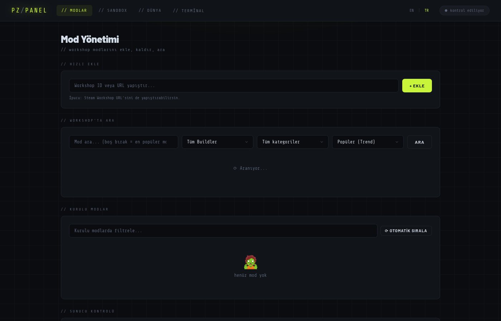
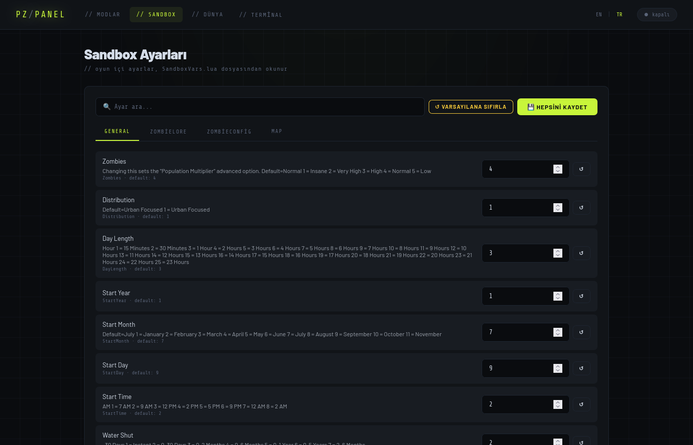
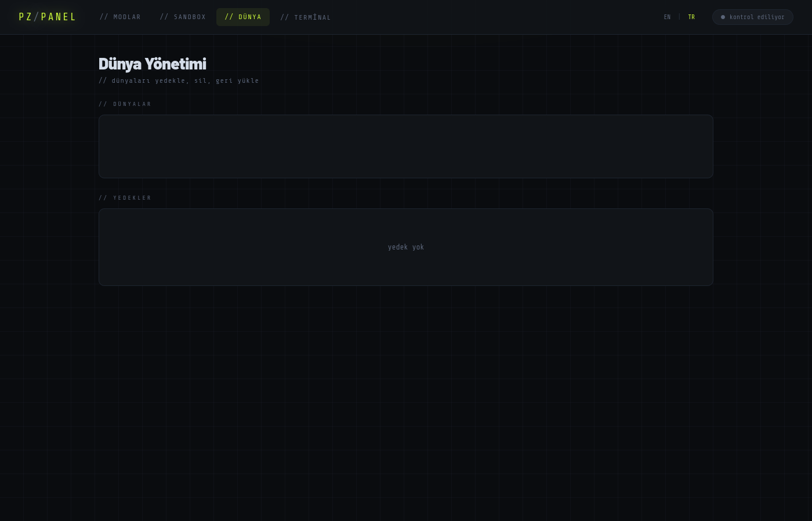
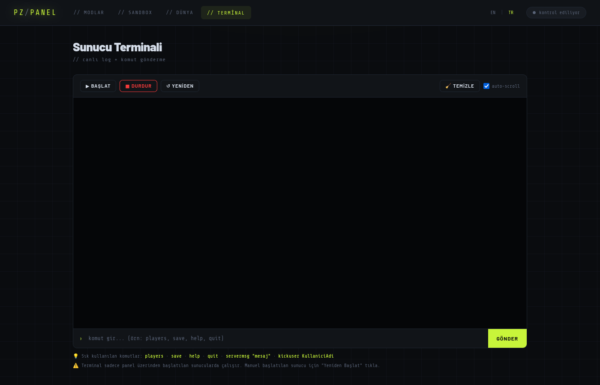
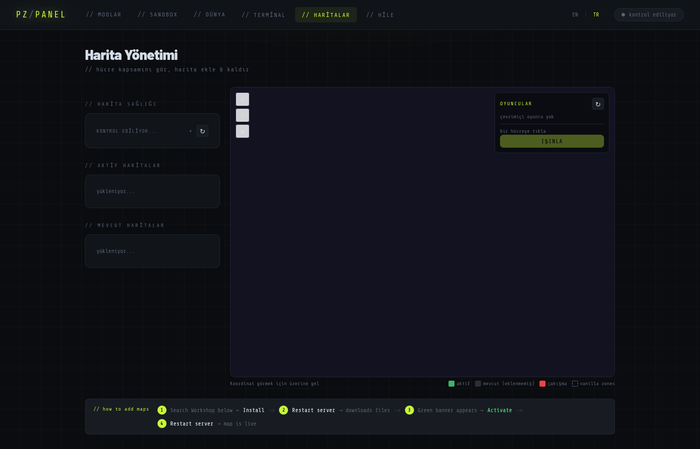
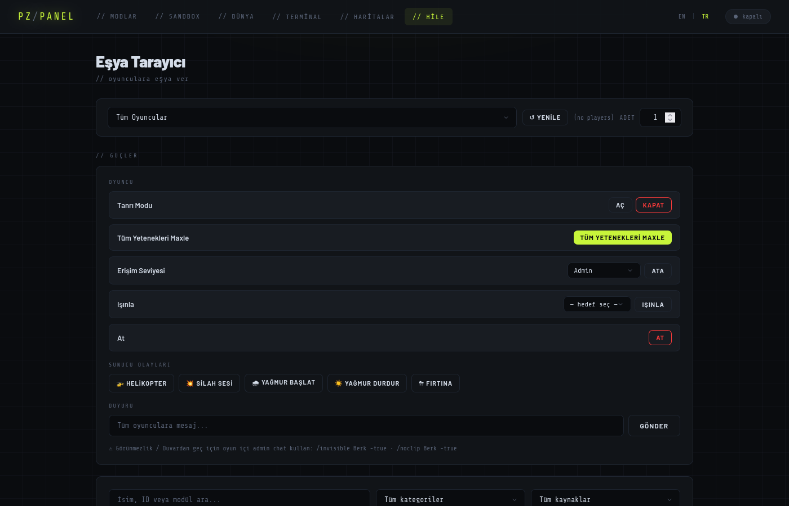

# Project Zomboid Server Panel for Linux

A web-based control panel for managing a Project Zomboid Dedicated Server on Linux. Manage mods, maps, sandbox settings, game worlds, admin powers, and the server process — all from your browser.

> **Language / Dil:** [English](#english) · [Türkçe](#türkçe)

---

<a name="english"></a>
# English

## Features

- **Mod Management** — Search Steam Workshop by keyword or URL, auto-resolve all dependencies, drag-and-drop load order reordering, and category filtering
- **Map Management** — Visual map grid showing which cells each map covers, add/remove workshop maps, detect overlapping cells (which crash the server), manage spawn regions, teleport players to any map location
- **Sandbox Configuration** — Browse and edit every `SandboxVars.lua` setting (vanilla + mod settings) through a clean tabbed UI without touching any files manually
- **World Management** — List all save files, create compressed `.tar.gz` backups, restore from a backup, and delete worlds safely
- **Real-time Terminal** — Start, stop, and restart the server; stream live logs directly in the browser; send console commands without SSH
- **Admin / Cheats** — Search and give any item or spawn any vehicle to online players; toggle god mode; max all skills; kick players; assign access levels; trigger server events (helicopter, gunshot, rain, thunder); broadcast messages

## Screenshots

| Mods | Sandbox |
|:---:|:---:|
|  |  |

| World | Terminal |
|:---:|:---:|
|  |  |

| Maps | Cheats / Admin |
|:---:|:---:|
|  |  |

## Prerequisites

- Linux (Ubuntu/Debian recommended)
- Python 3.8+
- ~6 GB free disk space (for the PZ dedicated server)
- Internet connection (for SteamCMD and mod downloads)

---

## Setup Guide

### Step 1 — Install SteamCMD

SteamCMD is the command-line tool used to download and update dedicated game servers from Steam.

**Ubuntu / Debian:**
```bash
sudo add-apt-repository multiverse
sudo dpkg --add-architecture i386
sudo apt update
sudo apt install steamcmd
```

**Other distros (manual install):**
```bash
mkdir ~/steamcmd && cd ~/steamcmd
curl -O https://steamcdn-a.akamaihd.net/client/installer/steamcmd_linux.tar.gz
tar -xvzf steamcmd_linux.tar.gz
```
Use `~/steamcmd/steamcmd.sh` instead of `steamcmd` in the commands below.

---

### Step 2 — Download the Project Zomboid Dedicated Server

The PZ Dedicated Server is free to download (no game license needed). Its Steam App ID is **380870**.

```bash
steamcmd \
  +login anonymous \
  +force_install_dir "$HOME/.local/share/Steam/steamapps/common/Project Zomboid Dedicated Server" \
  +app_update 380870 validate \
  +quit
```

This downloads roughly **5–6 GB**. To update the server later, run the same command again.

---

### Step 3 — First Server Run (generates config files)

The panel needs `servertest.ini` and `servertest_SandboxVars.lua` to exist before it can work. These files are created automatically on the first server launch.

```bash
cd "$HOME/.local/share/Steam/steamapps/common/Project Zomboid Dedicated Server"
bash start-server.sh
```

Wait until you see output like `Server started` or `LuaManager: Loading` in the terminal, then press **Ctrl+C** to stop it. The config files will now be at:

```
~/Zomboid/Server/servertest.ini
~/Zomboid/Server/servertest_SandboxVars.lua
```

> If the server asks you to set an admin password on first run, go ahead and set one — you can always change it later.

---

### Step 4 — Install the Panel

```bash
git clone https://github.com/berkaydogdu88-del/Project-Zomboid-server-panel-for-linux.git
cd Project-Zomboid-server-panel-for-linux
pip install -r requirements.txt
```

---

### Step 5 — Configure Paths

Open `config.py` and verify that the paths match your system. The defaults work for a standard SteamCMD install:

| Variable | Default path | Description |
|---|---|---|
| `SERVER_DIR` | `~/.local/share/Steam/steamapps/common/Project Zomboid Dedicated Server` | Where `start-server.sh` lives |
| `ZOMBOID_DIR` | `~/Zomboid` | Game data directory (created by the server on first run) |
| `INI_PATH` | `~/Zomboid/Server/servertest.ini` | Main server config |
| `SANDBOX_PATH` | `~/Zomboid/Server/servertest_SandboxVars.lua` | Sandbox / difficulty settings |
| `SAVES_DIR` | `~/Zomboid/Saves` | Player save files |
| `BACKUP_DIR` | `~/Zomboid/Backups` | Where panel backups are stored |

If you used a different install directory for SteamCMD, update `SERVER_DIR` accordingly. Everything else derives from `ZOMBOID_DIR`, which is where the game writes its data regardless of where the server is installed.

---

### Step 6 — Run the Panel

```bash
python3 app.py
```

Open your browser at: **http://localhost:8621**

The panel runs on port `8621` by default. To reach it from another machine on your local network, use your machine's local IP (e.g. `http://192.168.1.x:8621`).

---

## Sharing Over the Internet with ZeroTier

ZeroTier creates a virtual private network that lets your friends connect to your server as if they were on the same local network — no port forwarding or exposing your real IP required.

### 1. Install ZeroTier on the host machine

```bash
curl -s https://install.zerotier.com | sudo bash
sudo systemctl enable zerotier-one
sudo systemctl start zerotier-one
```

### 2. Create a network

Go to [my.zerotier.com](https://my.zerotier.com), sign in (free), and click **Create A Network**. Note the **Network ID** (a 16-character hex string like `1c33c1ced0a12345`).

### 3. Join the network on the host machine

```bash
sudo zerotier-cli join <your-network-id>
```

Back on the ZeroTier Central dashboard, find your machine under **Members** and tick **Auth** to authorize it. Your machine will then be assigned a ZeroTier IP.

### 4. Find your ZeroTier IP

```bash
sudo zerotier-cli listnetworks
```

Look for the `IP/s` column — it will show something like `10.147.20.x`. This is the IP your friends will use to connect.

### 5. Allow the game ports through the firewall

ZeroTier uses its own virtual network interface (named `zt...`). You need to allow the game ports on that interface:

```bash
# Find your ZeroTier interface name
ip link show | grep zt

# Allow PZ ports on that interface (replace ztXXXXXX with your interface name)
sudo ufw allow in on ztXXXXXX to any port 16261 proto udp comment "PZ game port"
sudo ufw allow in on ztXXXXXX to any port 16262 proto udp comment "PZ direct connect"
```

### 6. Start the server

Use the panel terminal tab to start the server, or run `start-server.sh` manually.

### 7. Tell your friends

Your friends need to:
1. Install ZeroTier: [zerotier.com/download](https://www.zerotier.com/download/)
2. Join the same network: `zerotier-cli join <your-network-id>` (or use the desktop app)
3. You authorize them on the ZeroTier Central dashboard (tick **Auth** next to their machine)
4. Connect in Project Zomboid: **Join → Enter your ZeroTier IP → Port 16261**

> **Important:** The panel (port `8621`) is also reachable by anyone on your ZeroTier network. See the Security section below for how to lock it down.

---

## Panel Usage

| Tab | What it does |
|---|---|
| **Terminal** | Start/stop/restart the server. Displays live server logs. Type commands into the input box to send them directly to the server (e.g. `servermsg "Hello"`, `adduser`, `chopper`). |
| **Mods** | Search Steam Workshop, view mod details, add mods with auto-resolved dependencies, drag rows to reorder load order, remove mods. |
| **Maps** | Visual cell grid showing which areas each map covers. Add or remove workshop maps, detect overlapping cells (which can crash the server), manage spawn regions, and teleport online players to any map location. |
| **Sandbox** | Edit all sandbox settings (loot, zombie speed, XP multiplier, etc.) grouped by category. Mod-added settings appear under their own tab. |
| **World** | View all save files, create/restore/delete backups. The server must be stopped before restoring or deleting a world. |
| **Cheats** | Give any item or spawn any vehicle to online players. Toggle god mode, max all skills, kick players, set access levels, trigger server events (helicopter, gunshot, rain), and broadcast messages to everyone. |

The interface is available in **English** and **Turkish** — switch via the language selector in the top navigation bar.

---

## Security — Read Before Sharing

> **This panel has no login system.** Anyone who can reach the URL has full admin control over your server. This was built for personal use on a trusted private network.

### What the panel can do

- Start, stop, and restart your server
- Give any item, spawn vehicles, toggle god mode, kick and set access levels for players
- Delete game worlds (this is irreversible without a backup)
- Read and overwrite your server config files (`servertest.ini`, `SandboxVars.lua`, spawn regions)

### What you should know before using it

| Risk | What to do |
|---|---|
| **Panel exposed to friends on ZeroTier** | The panel binds to all interfaces (`0.0.0.0`). Anyone on your ZeroTier network can reach port `8621`. Block it with: `sudo ufw deny in on ztXXXXXX to any port 8621` — replace `ztXXXXXX` with your ZeroTier interface name. |
| **Panel exposed on your local network** | If others are on the same LAN (office, dorm, shared Wi-Fi), they can reach the panel. Run the panel only on a private home network, or bind it to `127.0.0.1` only by editing the last line of `app.py`: change `host="0.0.0.0"` to `host="127.0.0.1"`. |
| **Never expose it to the public internet** | Do not forward port `8621` in your router. Do not put it behind a public reverse proxy without adding authentication yourself. |
| **Accidental world deletion** | The World tab can permanently delete saves. Always create a backup before touching the delete button. |
| **Cheats tab is very powerful** | It can wipe skills, kick anyone, assign admin roles. Don't run the panel on a shared machine where others have browser access. |

### Quick lockdown if you only need local access

Edit the last line of `app.py`:
```python
# Before (accessible from the whole network):
app.run(host="0.0.0.0", port=8621, debug=False, threaded=True)

# After (localhost only — only you can reach it):
app.run(host="127.0.0.1", port=8621, debug=False, threaded=True)
```

---

## Tips and Things to Know

- **Map changes require a server restart** — Adding or removing a map in the Maps tab writes to `servertest.ini` immediately, but the server reads that file only on startup.
- **Workshop items need a server restart to download** — When you add a mod or map through the panel, it updates the INI file. The actual files are downloaded by the server on its next startup via SteamCMD.
- **Map overlaps crash the server** — The Maps tab warns you when two active maps share cells. Remove one of the conflicting maps before starting the server.
- **Adding a map to an existing world** — If a mod map's cells were already generated as vanilla terrain in your current save, the new map won't fully overwrite them. The Maps tab will warn you about this. Starting a fresh world is the cleanest solution.
- **The Cheats item list is built from your active mods** — It parses script files from the server's media folder and your installed mods. It only shows items from mods that are currently active in `servertest.ini`.
- **Backups are stored locally** — The World tab backups are `.tar.gz` archives saved to `~/Zomboid/Backups`. Copy them off the machine periodically if you care about the save.

---

## Project Structure

```
pz_panel/
├── app.py                  # Flask entry point, route registration
├── config.py               # All file paths and server helpers
├── requirements.txt        # Python dependencies
├── modules/
│   ├── server.py           # Server control routes + SSE log streaming
│   ├── server_manager.py   # PTY process manager, 2000-line log buffer
│   ├── mods.py             # Steam Workshop search, dependency resolver
│   ├── sandbox.py          # SandboxVars.lua parser and editor
│   ├── world.py            # Save backup / restore / delete
│   ├── maps.py             # Map grid, add/remove/overlap detection, teleport
│   └── cheats.py           # Item browser, give items, admin power actions
├── templates/              # Jinja2 HTML templates (one per tab)
├── static/style.css        # All frontend styling
└── translations/
    ├── en.json             # English UI strings
    └── tr.json             # Turkish UI strings
```

---

## Troubleshooting

| Problem | Fix |
|---|---|
| Panel opens but server won't start | Check that `SERVER_DIR` in `config.py` points to the folder containing `start-server.sh`. Run `ls "$HOME/.local/share/Steam/steamapps/common/Project Zomboid Dedicated Server"` to verify. |
| `servertest.ini` not found / Sandbox tab is empty | Run the server once manually (`bash start-server.sh`) to generate the config files, then restart the panel. |
| Mod tab shows no search results | Check your internet connection. The panel queries the Steam Workshop API directly — no Steam client needed. |
| Maps tab shows no maps | Make sure the server was run at least once and `SERVER_DIR` is correct. The vanilla maps live inside the server's `media/maps/` folder. |
| Cheats item list is empty | The server must be installed and `SERVER_DIR` must point to the right folder. Items are parsed from `media/scripts/` inside the server directory. |
| Map overlap warning on the Maps tab | Two active maps share terrain cells. Remove one of them — running both will crash the server on startup. |
| Friends can't connect over ZeroTier | Confirm: (1) both sides are authorized in ZeroTier Central, (2) UFW allows UDP 16261 on the ZeroTier interface, (3) the server is actually running (check the Terminal tab). |
| `ModuleNotFoundError: No module named 'flask'` | Run `pip3 install -r requirements.txt` from the panel directory. |
| Terminal tab shows no output after server start | The panel uses a PTY — make sure you're running `python3 app.py` as the same Linux user who owns the server install directory. |
| Port 8621 not reachable from another machine | If UFW is active, run `sudo ufw allow 8621/tcp`. On ZeroTier, add a rule for the `zt...` interface as shown in the ZeroTier section. |

---

## License

MIT

---
---

<a name="türkçe"></a>
# Türkçe

Linux üzerinde bir Project Zomboid Dedicated Server'ı yönetmek için web tabanlı bir kontrol paneli. Modları, haritaları, sandbox ayarlarını, oyun dünyalarını, yönetici araçlarını ve sunucu sürecini tamamen tarayıcıdan yönetin.

## Özellikler

- **Mod Yönetimi** — Steam Workshop'ta anahtar kelime veya URL ile arama, tüm bağımlılıkları otomatik çözme, sürükle-bırak ile yükleme sırası düzenleme ve kategori filtreleme
- **Harita Yönetimi** — Her haritanın hangi hücreleri kapsadığını gösteren görsel ızgara, workshop haritalarını ekleme/kaldırma, çakışan hücreleri tespit etme (sunucu çökmesine neden olur), doğum bölgelerini yönetme, oyuncuları harita konumlarına ışınlama
- **Sandbox Yapılandırması** — Her `SandboxVars.lua` ayarını (vanilla + mod ayarları) dosyalara dokunmadan sekmeli arayüz üzerinden düzenleme
- **Dünya Yönetimi** — Tüm kayıt dosyalarını listeleme, sıkıştırılmış `.tar.gz` yedekler oluşturma, yedekten geri yükleme ve dünyaları güvenli silme
- **Gerçek Zamanlı Terminal** — Sunucuyu başlatma, durdurma ve yeniden başlatma; canlı logları tarayıcıda izleme; SSH olmadan konsol komutları gönderme
- **Yönetici / Cheat'ler** — Çevrimiçi oyunculara herhangi bir eşya verme veya araç oluşturma; tanrı modunu açıp kapama; tüm becerileri maxlama; oyuncuları atma; erişim seviyesi atama; sunucu olaylarını tetikleme (helikopter, silah sesi, yağmur, gök gürültüsü); herkese mesaj yayınlama

## Ekran Görüntüleri

| Modlar | Sandbox |
|:---:|:---:|
|  |  |

| Dünya | Terminal |
|:---:|:---:|
|  |  |

| Haritalar | Cheat'ler / Yönetici |
|:---:|:---:|
|  |  |

## Gereksinimler

- Linux (Ubuntu/Debian önerilir)
- Python 3.8+
- ~6 GB boş disk alanı (PZ dedicated server için)
- İnternet bağlantısı (SteamCMD ve mod indirmeleri için)

---

## Kurulum Kılavuzu

### Adım 1 — SteamCMD Kurulumu

SteamCMD, Steam'den dedicated game server indirip güncellemek için kullanılan komut satırı aracıdır.

**Ubuntu / Debian:**
```bash
sudo add-apt-repository multiverse
sudo dpkg --add-architecture i386
sudo apt update
sudo apt install steamcmd
```

**Diğer dağıtımlar (manuel kurulum):**
```bash
mkdir ~/steamcmd && cd ~/steamcmd
curl -O https://steamcdn-a.akamaihd.net/client/installer/steamcmd_linux.tar.gz
tar -xvzf steamcmd_linux.tar.gz
```
Aşağıdaki komutlarda `steamcmd` yerine `~/steamcmd/steamcmd.sh` kullanın.

---

### Adım 2 — Project Zomboid Dedicated Server İndirme

PZ Dedicated Server ücretsiz indirilir (oyun lisansına gerek yok). Steam App ID'si **380870**'dir.

```bash
steamcmd \
  +login anonymous \
  +force_install_dir "$HOME/.local/share/Steam/steamapps/common/Project Zomboid Dedicated Server" \
  +app_update 380870 validate \
  +quit
```

Bu işlem yaklaşık **5–6 GB** indirir. Sunucuyu güncellemek için aynı komutu tekrar çalıştırın.

---

### Adım 3 — İlk Sunucu Çalıştırma (yapılandırma dosyalarını oluşturur)

Panel çalışmadan önce `servertest.ini` ve `servertest_SandboxVars.lua` dosyalarının var olması gerekir. Bu dosyalar ilk sunucu başlatmada otomatik oluşturulur.

```bash
cd "$HOME/.local/share/Steam/steamapps/common/Project Zomboid Dedicated Server"
bash start-server.sh
```

Terminalde `Server started` veya `LuaManager: Loading` gibi bir çıktı görünce **Ctrl+C** ile durdurun. Yapılandırma dosyaları artık şurada olacak:

```
~/Zomboid/Server/servertest.ini
~/Zomboid/Server/servertest_SandboxVars.lua
```

> İlk çalıştırmada sunucu admin şifresi istiyorsa belirleyin — daha sonra değiştirebilirsiniz.

---

### Adım 4 — Paneli Kurma

```bash
git clone https://github.com/berkaydogdu88-del/Project-Zomboid-server-panel-for-linux.git
cd Project-Zomboid-server-panel-for-linux
pip install -r requirements.txt
```

---

### Adım 5 — Yolları Yapılandırma

`config.py` dosyasını açın ve yolların sisteminizle eşleştiğini doğrulayın. Varsayılanlar standart bir SteamCMD kurulumu için geçerlidir:

| Değişken | Varsayılan yol | Açıklama |
|---|---|---|
| `SERVER_DIR` | `~/.local/share/Steam/steamapps/common/Project Zomboid Dedicated Server` | `start-server.sh` burada bulunur |
| `ZOMBOID_DIR` | `~/Zomboid` | Oyun veri dizini (ilk çalıştırmada sunucu tarafından oluşturulur) |
| `INI_PATH` | `~/Zomboid/Server/servertest.ini` | Ana sunucu yapılandırması |
| `SANDBOX_PATH` | `~/Zomboid/Server/servertest_SandboxVars.lua` | Sandbox / zorluk ayarları |
| `SAVES_DIR` | `~/Zomboid/Saves` | Oyuncu kayıt dosyaları |
| `BACKUP_DIR` | `~/Zomboid/Backups` | Panel yedeklerinin kaydedileceği yer |

SteamCMD için farklı bir kurulum dizini kullandıysanız `SERVER_DIR`'i güncelleyin. Diğer her şey `ZOMBOID_DIR`'den türetilir.

---

### Adım 6 — Paneli Çalıştırma

```bash
python3 app.py
```

Tarayıcınızda açın: **http://localhost:8621**

Panel varsayılan olarak `8621` portunda çalışır. Yerel ağdaki başka bir makineden erişmek için makinenizin yerel IP'sini kullanın (örn. `http://192.168.1.x:8621`).

---

## ZeroTier ile İnternet Üzerinden Paylaşım

ZeroTier, arkadaşlarınızın sunucunuza aynı yerel ağdaymış gibi bağlanmasını sağlayan sanal bir özel ağ oluşturur. Port yönlendirme veya gerçek IP'nizi paylaşma gerekmez.

### 1. Host makinede ZeroTier kurulumu

```bash
curl -s https://install.zerotier.com | sudo bash
sudo systemctl enable zerotier-one
sudo systemctl start zerotier-one
```

### 2. Ağ oluşturma

[my.zerotier.com](https://my.zerotier.com) adresine gidin, ücretsiz hesap açın ve **Create A Network**'e tıklayın. **Network ID**'yi not edin (`1c33c1ced0a12345` gibi 16 karakterli onaltılık bir dize).

### 3. Host makinede ağa katılma

```bash
sudo zerotier-cli join <network-id'niz>
```

ZeroTier Central panosunda **Members** altında makinenizi bulun ve yetkilendirmek için **Auth**'u işaretleyin. Makinenize bir ZeroTier IP'si atanacaktır.

### 4. ZeroTier IP'nizi bulma

```bash
sudo zerotier-cli listnetworks
```

`IP/s` sütununa bakın — `10.147.20.x` gibi bir şey göreceksiniz. Arkadaşlarınızın kullanacağı IP budur.

### 5. Güvenlik duvarında oyun portlarını açma

ZeroTier kendi sanal ağ arayüzünü (`zt...` ile başlar) kullanır. Bu arayüzde oyun portlarına izin vermeniz gerekir:

```bash
# ZeroTier arayüz adınızı bulun
ip link show | grep zt

# O arayüzde PZ portlarına izin verin (ztXXXXXX'i kendi arayüz adınızla değiştirin)
sudo ufw allow in on ztXXXXXX to any port 16261 proto udp comment "PZ oyun portu"
sudo ufw allow in on ztXXXXXX to any port 16262 proto udp comment "PZ doğrudan bağlantı"
```

### 6. Sunucuyu başlatın

Panel terminal sekmesini kullanarak sunucuyu başlatın veya `start-server.sh` komutunu elle çalıştırın.

### 7. Arkadaşlarınıza anlatın

Arkadaşlarınızın yapması gerekenler:
1. ZeroTier'ı kurun: [zerotier.com/download](https://www.zerotier.com/download/)
2. Aynı ağa katılın: `zerotier-cli join <network-id'niz>` (veya masaüstü uygulamasını kullanın)
3. ZeroTier Central panosunda **Auth**'u işaretleyerek onları yetkilendirin
4. Project Zomboid'de bağlanın: **Çevrimiçi Oyna → IP adresinizi girin → Port 16261**

> **Önemli:** Panel (port `8621`) de ZeroTier ağındaki herkese erişilebilir. Bunu kısıtlamak için aşağıdaki güvenlik bölümüne bakın.

---

## Panel Kullanımı

| Sekme | Ne yapar |
|---|---|
| **Terminal** | Sunucuyu başlatır/durdurur/yeniden başlatır. Canlı sunucu loglarını gösterir. Giriş kutusuna komut yazarak doğrudan sunucuya gönderin (örn. `servermsg "Merhaba"`, `adduser`, `chopper`). |
| **Modlar** | Steam Workshop'ta arama, mod detaylarını görüntüleme, bağımlılıkları otomatik çözümlenmiş mod ekleme, yükleme sırasını düzenlemek için satırları sürükleme, mod kaldırma. |
| **Haritalar** | Her haritanın hangi hücreleri kapsadığını gösteren görsel ızgara. Workshop haritalarını ekleme/kaldırma, çakışan hücreleri tespit etme (sunucu çökmesine neden olur), doğum bölgelerini yönetme ve çevrimiçi oyuncuları harita konumlarına ışınlama. |
| **Sandbox** | Tüm sandbox ayarlarını (ganimetler, zombi hızı, XP çarpanı vb.) kategoriye göre gruplandırılmış şekilde düzenleme. Mod ekleyen ayarlar kendi sekmeleri altında görünür. |
| **Dünya** | Tüm kayıt dosyalarını görüntüleme, yedek oluşturma/geri yükleme/silme. Bir dünyayı geri yüklemeden veya silmeden önce sunucunun durdurulması gerekir. |
| **Cheat'ler** | Çevrimiçi oyunculara herhangi bir eşya verme veya araç oluşturma. Tanrı modunu açıp kapama, tüm becerileri maxlama, oyuncu atma, erişim seviyesi atama, sunucu olaylarını tetikleme (helikopter, silah sesi, yağmur) ve herkese mesaj yayınlama. |

Arayüz **İngilizce** ve **Türkçe** dillerinde mevcuttur — üst gezinme çubuğundaki dil seçici ile değiştirin.

---

## Güvenlik — Paylaşmadan Önce Okuyun

> **Bu panelin giriş sistemi yoktur.** URL'ye erişebilen herkes sunucunuz üzerinde tam yönetici kontrolüne sahip olur. Güvenilir bir özel ağda kişisel kullanım için tasarlanmıştır.

### Panel ne yapabilir

- Sunucuyu başlatma, durdurma ve yeniden başlatma
- Oyunculara eşya verme, araç oluşturma, tanrı modunu açma, atma ve erişim seviyesi belirleme
- Oyun dünyalarını silme (bu geri alınamaz, yedek olmadan)
- Sunucu yapılandırma dosyalarını okuma ve üzerine yazma

### Kullanmadan önce bilmeniz gerekenler

| Risk | Ne yapmalı |
|---|---|
| **Panel ZeroTier'daki arkadaşlara açık** | Panel tüm arayüzlere bağlanır (`0.0.0.0`). ZeroTier ağınızdaki herkes `8621` portuna erişebilir. Engellemek için: `sudo ufw deny in on ztXXXXXX to any port 8621` (ztXXXXXX'i kendi ZeroTier arayüz adınızla değiştirin). |
| **Panel yerel ağınıza açık** | Aynı LAN'da başkaları varsa (ofis, yurt, ortak Wi-Fi), panele erişebilirler. Paneli yalnızca güvenilen ev ağında çalıştırın veya `app.py`'nin son satırını düzenleyerek `host="0.0.0.0"` yerine `host="127.0.0.1"` yazın. |
| **Asla internete açmayın** | Routerınızda `8621` portunu yönlendirmeyin. Kendiniz kimlik doğrulama eklemeden herkese açık bir reverse proxy'nin arkasına koymayın. |
| **Yanlışlıkla dünya silme** | Dünya sekmesi kayıtları kalıcı olarak silebilir. Silme düğmesine basmadan önce her zaman yedek oluşturun. |
| **Cheat sekmesi çok güçlü** | Becerileri sıfırlayabilir, herkesi atabilir, admin rolü atayabilir. Paneli, başkalarının tarayıcı erişimine sahip olduğu paylaşımlı bir makinede çalıştırmayın. |

### Yalnızca yerel erişime ihtiyaç duyuyorsanız hızlı kilitleyici

`app.py`'nin son satırını düzenleyin:
```python
# Önce (tüm ağdan erişilebilir):
app.run(host="0.0.0.0", port=8621, debug=False, threaded=True)

# Sonra (yalnızca localhost — sadece siz erişebilirsiniz):
app.run(host="127.0.0.1", port=8621, debug=False, threaded=True)
```

---

## İpuçları ve Bilinmesi Gerekenler

- **Harita değişiklikleri sunucu yeniden başlatması gerektirir** — Haritalar sekmesinde harita ekleyip kaldırmak `servertest.ini`'ye hemen yazar, ancak sunucu bu dosyayı yalnızca başlatmada okur.
- **Workshop eşyaları indirmek için sunucu yeniden başlatması gerekir** — Panel üzerinden mod veya harita eklediğinizde INI dosyası güncellenir. Asıl dosyalar, sunucunun bir sonraki başlatmasında SteamCMD aracılığıyla indirilir.
- **Harita çakışmaları sunucuyu çökertir** — İki aktif harita aynı hücreleri paylaşıyorsa Haritalar sekmesi sizi uyarır. Sunucuyu başlatmadan önce çakışan haritalardan birini kaldırın.
- **Mevcut bir dünyaya harita ekleme** — Bir mod haritasının hücreleri mevcut kayıtta zaten vanilla arazi olarak oluşturulmuşsa, yeni harita bunları tam olarak geçersiz kılmaz. Haritalar sekmesi bu konuda sizi uyarır. En temiz çözüm yeni bir dünya başlatmaktır.
- **Cheat eşya listesi aktif modlarınızdan oluşturulur** — Sunucunun media klasöründeki ve yüklü modlarınızdaki betik dosyalarını ayrıştırır. Yalnızca `servertest.ini`'de şu anda aktif olan modların eşyalarını gösterir.
- **Yedekler yerel olarak saklanır** — Dünya sekmesi yedekleri `~/Zomboid/Backups` dizininde `.tar.gz` arşivleri olarak kaydedilir. Kayıtlarınıza önem veriyorsanız bunları düzenli olarak başka bir yere kopyalayın.

---

## Proje Yapısı

```
pz_panel/
├── app.py                  # Flask giriş noktası, rota kaydı
├── config.py               # Tüm dosya yolları ve sunucu yardımcıları
├── requirements.txt        # Python bağımlılıkları
├── modules/
│   ├── server.py           # Sunucu kontrol rotaları + SSE log akışı
│   ├── server_manager.py   # PTY süreç yöneticisi, 2000 satır log tamponu
│   ├── mods.py             # Steam Workshop arama, bağımlılık çözücü
│   ├── sandbox.py          # SandboxVars.lua ayrıştırıcı ve düzenleyici
│   ├── world.py            # Kayıt yedekleme / geri yükleme / silme
│   ├── maps.py             # Harita ızgarası, ekleme/kaldırma/çakışma tespiti, ışınlama
│   └── cheats.py           # Eşya tarayıcı, eşya verme, yönetici güç eylemleri
├── templates/              # Jinja2 HTML şablonları (her sekme için bir tane)
├── static/style.css        # Tüm ön yüz stilleri
└── translations/
    ├── en.json             # İngilizce arayüz metinleri
    └── tr.json             # Türkçe arayüz metinleri
```

---

## Sorun Giderme

| Sorun | Çözüm |
|---|---|
| Panel açılıyor ama sunucu başlamıyor | `config.py`'daki `SERVER_DIR`'in `start-server.sh` dosyasının bulunduğu klasörü gösterdiğini kontrol edin. `ls "$HOME/.local/share/Steam/steamapps/common/Project Zomboid Dedicated Server"` ile doğrulayın. |
| `servertest.ini` bulunamadı / Sandbox sekmesi boş | Yapılandırma dosyalarını oluşturmak için sunucuyu bir kez elle çalıştırın (`bash start-server.sh`), ardından paneli yeniden başlatın. |
| Mod sekmesinde arama sonucu yok | İnternet bağlantınızı kontrol edin. Panel doğrudan Steam Workshop API'sini sorgular — Steam istemcisi gerekmez. |
| Haritalar sekmesinde harita görünmüyor | Sunucunun en az bir kez çalıştırıldığından ve `SERVER_DIR`'in doğru olduğundan emin olun. Vanilla haritalar sunucunun `media/maps/` klasöründe bulunur. |
| Cheat eşya listesi boş | Sunucunun kurulmuş olması ve `SERVER_DIR`'in doğru klasörü göstermesi gerekir. Eşyalar sunucu dizinindeki `media/scripts/` dosyalarından ayrıştırılır. |
| Haritalar sekmesinde harita çakışma uyarısı | İki aktif harita aynı arazi hücrelerini paylaşıyor. Bunlardan birini kaldırın — her ikisi de aktifken sunucu başlatmada çökecektir. |
| Arkadaşlar ZeroTier üzerinden bağlanamıyor | Şunları kontrol edin: (1) her iki taraf ZeroTier Central'da yetkilendirilmiş, (2) UFW ZeroTier arayüzünde UDP 16261'e izin veriyor, (3) sunucu gerçekten çalışıyor (Terminal sekmesine bakın). |
| `ModuleNotFoundError: No module named 'flask'` | Panel dizininden `pip3 install -r requirements.txt` komutunu çalıştırın. |
| Terminal sekmesi sunucu başladıktan sonra çıktı göstermiyor | Panel PTY kullanıyor — `python3 app.py` komutunu sunucu kurulum dizinine sahip olan Linux kullanıcısı olarak çalıştırdığınızdan emin olun. |
| 8621 portu başka makineden ulaşılamıyor | UFW aktifse `sudo ufw allow 8621/tcp` çalıştırın. ZeroTier'da ZeroTier bölümünde gösterildiği gibi `zt...` arayüzü için bir kural ekleyin. |

---

## Lisans

MIT
